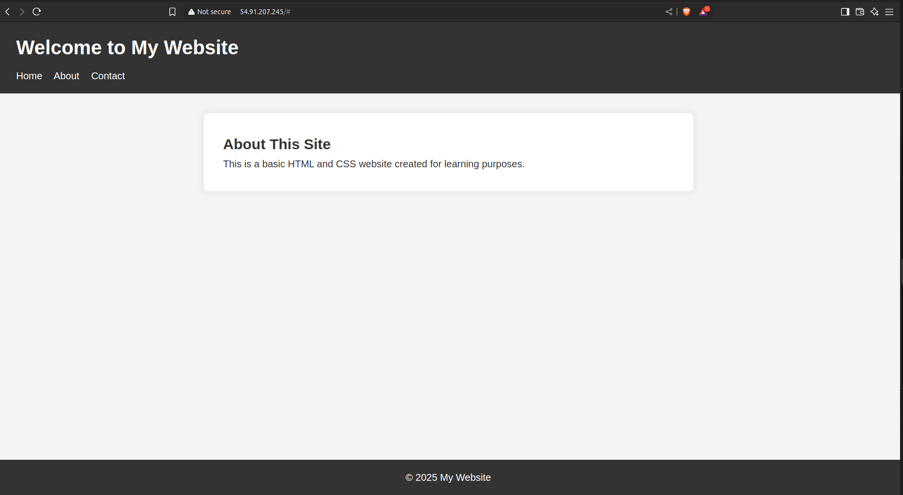

# 🌐 Launch a Linux EC2 instance, install a web server (Apache/Nginx), and host a basic HTML/CSS website.

## ✅ Project Goal
A live website accessible on the internet, hosted through a fully configured AWS EC2 server .

## 🚀 Tech Stack
- Use AWS EC2 (Ubuntu)
- Use Nginx as Web Server
- HTML5 + CSS3

## 🔧 Steps Followed
1. Created a free-tier EC2 instance
2.Configure security group in EC2
3. SSH'ed into the instance
4. Installed Nginx using `sudo apt install nginx` for Web server
5. Copied website files to `/var/www/html`
6. Accessed live site via public IP: `http://<your-ip>`

## 🌍 Live Demo
[Live Website](http://54.91.207.245)

## 📝 Screenshots

