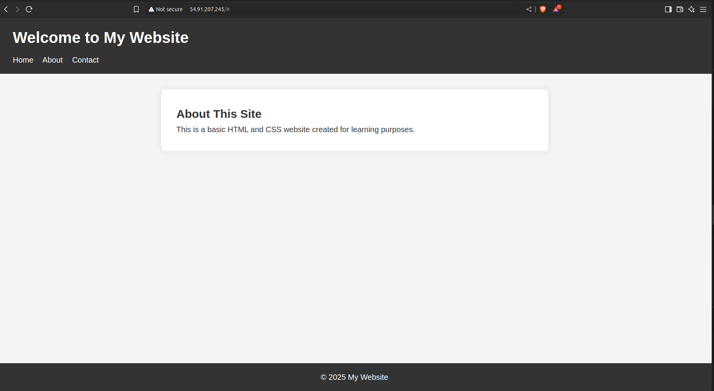

# 🌐 Static Website Hosting using Amazon S3 and CloudFront

This project demonstrates how to host a simple static website using **Amazon S3** and distribute it globally with **Amazon CloudFront**.

---

## ✅ Steps I Followed

### 1. Created the Website

- I created a basic `index.html` file for the website.

### 2. Created an S3 Bucket

- Logged into the AWS Management Console
- Went to **Amazon S3**
- Created a new bucket with a unique name
- **Did NOT enable public access**, keeping the bucket private

### 3. Uploaded Website Files

- Uploaded `index.html`  to the S3 bucket

### 4. Set Up CloudFront

- Went to **CloudFront** in the AWS console
- Created a new **CloudFront distribution**
- Selected my S3 bucket as the **origin**
- Enabled **Origin Access Control (OAC)** to keep S3 secure
- Set **default root object** as `index.html`

### 5. Accessed the Website

- Opened the **CloudFront distribution URL** in the browser
- ✅ Website loaded successfully from the nearest edge location

---

## 🌍 Live Website

👉 [View Web Page Hosted via CloudFront](https://d34u8xe7olcjrh.cloudfront.net/)

---

## 🖼 Screenshot

---

## 📌 Key Concepts Learned

- Hosting static content securely using **Amazon S3**
- Distributing it globally using **Amazon CloudFront**
- Understanding **Origin Access Control (OAC)** for S3 security
- How CDNs improve performance by caching content near the user

---

